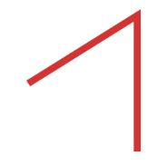
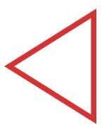
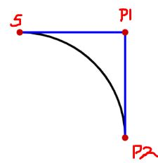
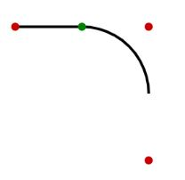
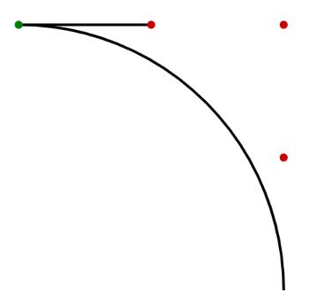
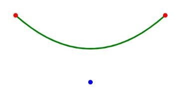
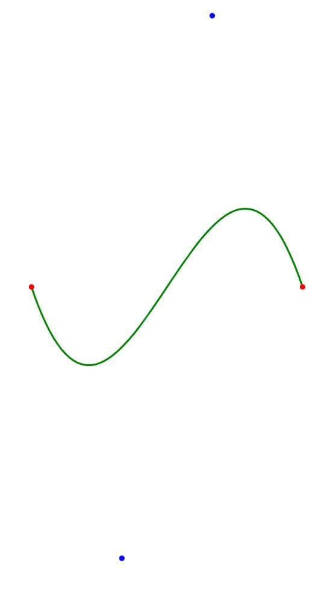

# [Canvas API] 1. 기본 사용

Canvas API는 canvas 태그를 통해 사용 가능합니다.

canvas요소에는 width와 height 두 속성만 있으며 DOM 프로퍼티를 사용하여 설정할 수도 있습니다.

기본적으로 너비는 300px, 높이는 150px입니다.

css를 통해 임의로 크기를 정할 수 있지만 렌더링하는 동안 이미지는 레이아웃 크기에 맞춰 조정되므로

**css 크기 지정이 초기 캔버스의 비율을 고려하지 않으면 왜곡되어 나타날 수 있습니다.**

mdn 사이트에서는 왜곡이 발생했다면 canvas 속성에서 width와 height 속성을 명시적으로 지정하라고 되어있습니다.

**또한 닫는 태그(<\/canvas>)가 필수입니다!!** 닫는 태그가 없다면 나머지 부분이 보이지 않습니다.

## 설정

먼저 html파일에 css와 js파일을 연결해줍니다.

이후 css파일에는 [reset.css](https://meyerweb.com/eric/tools/css/reset/)를 적용시키고

app.js는 다음과 같이 설정을 완료합니다.

설정은 [Interactive Developer]()님의 영상을 참고했습니다.

```js
class App {
  constructor() {
    // canvas 요소 생성
    this.canvas = document.createElement("canvas");

    // canvas 요소로부터 2d context 얻기
    this.ctx = this.canvas.getContext("2d");

    // html에 생성한 canvas를 넣기
    document.body.appendChild(this.canvas);

    // 화면 사이즈 설정
    window.addEventListener("resize", this.resize.bind(this), false);
    this.resize();
  }

  resize() {
    // 레티나 디스플레이에서 선명하게 보이기 위해 canvas의 크기를 body의 두배씩으로 잡는다.
    this.stageWidth = document.body.clientWidth;
    this.stageHeight = document.body.clientHeight;

    this.canvas.width = this.stageWidth * 2;
    this.canvas.height = this.stageHeight * 2;
    this.ctx.scale(2, 2);
  }
}

window.onload = () => {
  new App();
};
```

## 그리드

<div style="display:flex; flex-direction: column; align-items: center;">


<span>출처 : mdn</span>

</div>

위 사진과 같이 canvas의 기본 그리드의 원점(0, 0)은 좌측 상단입니다.

모든 요소들은 이 원점을 기준으로 위치됩니다.

## 직사각형을 그리기 위한 메서드

canvas는 오직 직사각형 도형만 제공합니다.

이외의 다른 도형들은 무조건 하나 혹은 하나 이상의 path와 여러 저믕로 이어진 선으로 만들어집니다.

1. `fillRect(x, y, width, height)`

[reference](https://developer.mozilla.org/en-US/docs/Web/API/CanvasRenderingContext2D/fillRect)

> 현재 설정된 fillStyle에 따라 정해진 크기의 직사각형 내부를 채웁니다.

x, y는 그리드상의 좌표이며

width는 양수라면 오른쪽 방향, 음수면 왼쪽 방향입니다.

height는 양수라면 아래쪽 방향, 음수면 위쪽 방향입니다.

크기는 |width| \* |height|가 됩니다.

<br/>

<br/>

2. `strokeRect(x, y, width, height)`

[reference](https://developer.mozilla.org/en-US/docs/Web/API/CanvasRenderingContext2D/strokeRect)

> 현재 설정된 strokeStyle에 따라 직사각형의 테두리를 그립니다.

x, y는 그리드상의 좌표이며

width는 양수라면 오른쪽 방향, 음수면 왼쪽 방향입니다.

height는 양수라면 아래쪽 방향, 음수면 위쪽 방향입니다.

크기는 |width| \* |height|가 됩니다.

<br/>

<br/>

3. `clearRect(x, y, width, height)`

[reference](https://developer.mozilla.org/en-US/docs/Web/API/CanvasRenderingContext2D/clearRect)

> 지정된 좌표에서 지정된 크기만큼의 직사각형 영역을 투명하게( transparent black, rgba(0,0,0,0) ) 만듭니다.

x, y는 그리드상의 좌표이며

width는 양수라면 오른쪽 방향, 음수면 왼쪽 방향입니다.

height는 양수라면 아래쪽 방향, 음수면 위쪽 방향입니다.

크기는 |width| \* |height|가 됩니다.

## 경로를 그리기 위한 메서드

경로(path)는 직사각형 이외의 유일한 원시적인 도형입니다.

경로를 이용하여 도형을 만들 때에는 경로를 생성하고, 그린 후 랜더링을 통해 canvas위에 그려지게 됩니다.

이때 경로를 닫지(close)않는다면, 특정 메서드는 렌더링 시 의도와는 다른 결과를 부를 수 있습니다.

**따라서 경로를 통해 그리려는 도형이 여러개라면 여러개의 경로를 생성해야합니다.**

1. `beginPath()`

[reference](https://developer.mozilla.org/en-US/docs/Web/API/CanvasRenderingContext2D/beginPath)

> 새로운 경로를 생성합니다.

<br/>

<br/>

2. `closePath()`

[reference](https://developer.mozilla.org/en-US/docs/Web/API/CanvasRenderingContext2D/closePath)

> 경로의 시작점과 끝점을 연결하고 경로를 닫습니다.

```js
this.ctx.lineWidth = 5;
this.ctx.strokeStyle = "rgba(200, 0, 0, 0.8)";

this.ctx.beginPath();
this.ctx.moveTo(300, 100);
this.ctx.lineTo(380, 50);
this.ctx.lineTo(380, 150);
this.ctx.stroke();
```

위와같이 경로를 구성하면



이렇게 시작점과 끝점이 연결되지 않은채로 경로가 그려지지만

closePath 메서드를 사용하면

```js
this.ctx.beginPath();
this.ctx.moveTo(400, 100);
this.ctx.lineTo(480, 50);
this.ctx.lineTo(480, 150);
this.ctx.closePath();
this.ctx.stroke();
```



위와 같이 경로의 시작점과 끝점이 연결되게됩니다.

단 위 코드는 단순히 경로 연결만 보여주는 것이 아닌 stroke 메서드로 직접 화면에 렌더링 하여 보여드렸음을 참고해주세요.

**단순히 closePath 메서드를 통해 연결된 경로는 화면에 보여지지 않습니다.**

<br/>

<br/>

3. `moveTo(x, y)`

[reference](https://developer.mozilla.org/en-US/docs/Web/API/CanvasRenderingContext2D/moveTo)

> 경로가 그려지는 시작점을 재 설정합니다.

x, y는 경로 시작점의 그리드상 위치입니다.

이때 moveTo메서드로 옮겨진 곳에서 시작하는 경로는 하위 경로(sub-path)라고 합니다.

**beginPath 메서드를 통해 시작된 경로에서 처음 경로를 그리게 되면 항상 그리게 되는 위치에 moveTo 메서드가 동작합니다.**

마치 펜을 떼고 다른 위치에 다시 펜을 대는 것과 같게됩니다.

<br/>

<br/>

4. `stroke()`

[reference](https://developer.mozilla.org/en-US/docs/Web/API/CanvasRenderingContext2D/stroke)

> 경로를 설정된 lineWidth와 strokeStyle을 통해 선 형태로 채웁니다.

stroke 메서드는 최종적으로 화면에 그릴 때 사용되는 메서드입니다.

따라서 stroke 메서드를 호출하면 화면에 렌더링되는 것을 볼 수 있습니다.

<br/>

<br/>

5. `lineTo(x, y)`

[reference](https://developer.mozilla.org/en-US/docs/Web/API/CanvasRenderingContext2D/lineTo)

> 이전 점부터 지정된 점까지 경로를 선으로 연결합니다.

x, y는 경로 끝점의 그리드상 위치입니다.

lineTo 메서드는 단순히 경로를 선 형태로 연결합니다.

**즉, 화면에 렌더링 하는 메서드가 아닙니다.**

<br/>

<br/>

6. `fill(path, fillRule)`

[reference](https://developer.mozilla.org/en-US/docs/Web/API/CanvasRenderingContext2D/fill)

> 현재 그려진 경로 혹은 주어진 경로를 설정된 fillStyle과 주어진 fillRule을 통해 채웁니다.

**fill 메서드 호출 시, 자동으로 closePath 메서드가 호출됩니다.**

인자로 들어갈 path와 fillRule은 생략 가능합니다.

### fillRule

이때 fillRule은 기본적으로 [nonzero](https://en.wikipedia.org/wiki/Nonzero-rule)이며, [evenodd](https://en.wikipedia.org/wiki/Even%E2%80%93odd_rule)로도 설정 가능합니다.


\<출처 mdn>

#### Nonzero Winding Rule

Nonzero Winding Rule은 경로와 상관없이 canvas 내의 어떤 점이 경로로 그려지는 도형의 내부인지 외부인지를 판별할 수 있게 해주는 알고리즘입니다.

위 이미지와 같이 경로는 **반시계 방향**으로 그려졌다고 가정합니다.(시계 방향이어도 상관 없습니다.)

이때 특정 점으로 부터 도형쪽(내부라면 바깥쪽, 외부라면 도형 쪽)으로 길이가 무한한 선을 그립니다. **이때 특정 점에서 시작해야합니다.**

<br/>

해당 선과 경로가 만나는 점을

- [경로가 반시계 방향이라고 가정 시]

경로가 왼쪽에서 오른쪽(또는 아래에서 위) 방향으로 지나가면 +1

경로가 오른쪼겡서 왼쪽(또는 위에서 아래) 방향으로 지나가면 -1

<br/>

- [경로가 시계 방향이라고 가정 시]

경로가 왼쪽에서 오른쪽(또는 아래에서 위) 방향으로 지나가면 -1

경로가 오른쪼겡서 왼쪽(또는 위에서 아래) 방향으로 지나가면 +1

<br/>

총 합이 0이라면 해당 점은 경로로 그려지는 도형 외부에 존재한다고 판단하며, 0이 아니라면 해당 점은 경로로 그려지는 도형 내부에 존재한다고 판단합니다.

예를들어 위 이미지에서 왼쪽 방향으로 x축과 평행하게 그려진 화살표(꼭 x축과 평행하지 않아도 됩니다)는

만나는 점에 대해 위에서 아래 방향으로 경로가 두번 지나가므로 -2입니다.

따라서 이 점은 경로로 그려지는 도형의 내부에 있다고 판단하여, 색칠됩니다.

#### Even-odd Rule

Even-odd Rule은 마찬가지로 특정 점으로부터 도형 외부 또는 도형 내부로 무한히 뻗는 선을 하나 그린 후

해당 선과 경로가 만나는 점의 개수가 홀수라면 내부, 짝수라면 외부라고 판단하는 알고리즘입니다.

예를들어 위 이미지에서 왼쪽 방향으로 x축과 평행하게 그려진 화살표(꼭 x축과 평행하지 않아도 됩니다)는 경로와 짝수번 만나게 되므로

도형의 외부라고 판단하여 색칠되지 않습니다.

<br/>

<br/>

## 호(arc)를 그리기 위한 메서드

호나 원을 그리기 위해서는 arc 또는 arcTo 메서드를 사용합니다.

1. `arc(x, y, radius, startAngle, endAngle, counterclockwise)`

[reference](https://developer.mozilla.org/en-US/docs/Web/API/CanvasRenderingContext2D/arc)

> 주어진 위치에 설정한 반지름과 각도만큼 호를 그립니다.

x, y는 canvas 그리드상 위치입니다.

radius는 호의 반지름이며, **양수여야합니다.**

호는 startAngle에서 시작해서 endAngle에서 끝납니다.

**이때 startAngle과 endAngle에 들어가는 각도 값은 라디안 값입니다.**

따라서 각으로 넣고싶다면

> (PI / 180) \* 각

을 통해 설정하면 됩니다.

counterclockwise가 true면 호를 반시계 방향으로 그리며,

false면 호를 시계 방향으로 그립니다.

<br/>

<br/>

2. `arcTo(x1, y1, x2, y2, radius)`

[reference](https://developer.mozilla.org/en-US/docs/Web/API/CanvasRenderingContext2D/arcTo)

> 경로의 시작점부터 (x1, y1) 까지의 선분과 (x1, y1)부터 (x2, y2) 까지의 선분이 형성하는 모서리에 맞도록 설정된 반지름을 갖는 호를 그립니다.

예를 들어 다음 코드로 호를 형성한다고 해보겠습니다.

```js
this.ctx.beginPath();
this.ctx.strokeStyle = "black";
this.ctx.lineWidth = 2;
this.ctx.moveTo(300, 400);
this.ctx.arcTo(400, 400, 400, 500, 100);
this.ctx.stroke();
```



그럼 위 그림과 같이 moveTo 메서드를 통해 정한 시작점이 S

(400, 400)에 위치한 점을 P1

(400, 500)에 위치한 점을 P2 라고 하면

S, P1, P2가 그리는 모서리에 맞도록 반지름이 100 인 호를 그리게 됩니다.

모서리에 맞도록 그려지는 호는 항상 호의 시작점과 경로의 시작점이 직선으로 이어지게 됩니다.

예를 들어

```js
this.ctx.moveTo(300, 400);
this.ctx.arcTo(400, 400, 400, 500, 50);
this.ctx.stroke();
```

와 같이 코드를 작성했다면



와 같이 그려지며(이때 초록색 점이 호의 시작점입니다.)

```js
this.ctx.moveTo(300, 400);
this.ctx.arcTo(400, 400, 400, 500, 200);
this.ctx.stroke();
```

와 같이 코드를 작성했다면



와 같이 그려지게 됩니다.(이때 초록색 점이 호의 시작점입니다.)

<br/>

<br/>

## 베지에 곡선(Bezier Curve)을 그리기 위한 메서드

[베지에 곡선 - 위키피디아](https://ko.wikipedia.org/wiki/%EB%B2%A0%EC%A7%80%EC%97%90_%EA%B3%A1%EC%84%A0)

[베지에 곡선 설명](https://blog.coderifleman.com/2016/12/30/bezier-curves/#:~:text=%ED%95%9C%EB%A7%88%EB%94%94%EB%A1%9C%20%E2%80%9C%EB%B2%A0%EC%A7%80%EC%97%90%20%EA%B3%A1%EC%84%A0,%EB%82%B4%EB%8A%94%20%EB%B0%A9%EB%B2%95%EC%9D%84%20%EB%9C%BB%ED%95%9C%EB%8B%A4.)


\<출처 mdn>

<br/>

### 2차 베지에 곡선(Quadratic Bezier Curve)

`quadraticCurveTo(cpx, cpy, x, y)`

[reference](https://developer.mozilla.org/en-US/docs/Web/API/CanvasRenderingContext2D/quadraticCurveTo)

> 경로의 시작점과 조절점 그리고 끝점에 대한 2차 베지에 곡선을 그립니다.

```js
this.ctx.beginPath();
this.ctx.strokeStyle = "green";
this.ctx.lineWidth = 2;
this.ctx.moveTo(startX, startY);
this.ctx.quadraticCurveTo(controlX, controlY, endX, endY);
this.ctx.stroke();
```



위 코드와 같이 작성하여 2차 베지에 곡선을 그릴 수 있습니다.

<br/>

### 3차 베지에 곡선(Cubic Bezier Curve)

`bezierCurveTo(cp1x, cp1y, cp2x, cp2y, x, y)`

[reference](https://developer.mozilla.org/en-US/docs/Web/API/CanvasRenderingContext2D/bezierCurveTo)

> 경로의 시작점, 첫번째 조절점, 두번째 조절점, 끝점에 대한 3차 베지에 곡선을 그립니다.

```js
this.ctx.beginPath();
this.ctx.strokeStyle = "green";
this.ctx.lineWidth = 2;
this.ctx.moveTo(startX, startY);
this.ctx.bezierCurveTo(
  firstControlX,
  firstControlY,
  secondControlX,
  secondControlY,
  endX,
  endY
);
this.ctx.stroke();
```



위 코드와 같이 작성하여 3차 베지에 곡선을 그릴 수 있습니다.

<br/>

<br/>

## Path2D Object

Path2D 객체를 사용하여 그리려는 경로를 기록하거나 캐싱할 수 있습니다.

```js
new Path2D();

new Path2D(path);

new Path2D(d);
```

[reference](https://developer.mozilla.org/en-US/docs/Web/API/Path2D/Path2D)

> 새로운 Path2D 객체를 생성하거나, 다른 Path2D 객체를 받아 복사한 하거나, SVG path 데이터를 path로 만들 수 있습니다.

```js
const a = new Path2D();
a.moveTo(200, 500);
a.lineTo(300, 500);

const b = new Path2D();
b.arc(200, 500, 2, 0, 2 * Math.PI, false);
b.arc(300, 500, 2, 0, 2 * Math.PI, false);

this.ctx.strokeStyle = "aqua";
this.ctx.fillStyle = "aqua";
this.ctx.lineWidth = 4;
this.ctx.stroke(a);
this.ctx.fill(b);
```

위와같이 직선을 그리는 Path2D object a와 Path2D object b를 만들어 사용할 수 있습니다.
