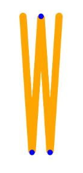
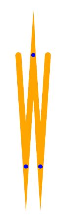

# [Canvas API] 2. 스타일 및 색상 적용하기

## 색상

도형에 색을 적용하는 경우 렌더링 하는 메서드에 따라 다른 스타일을 적용할 수 있습니다.

stroke 메서드를 사용한다면 strokeStyle에

fill 메서드를 사용한다면 fillStyle에 따로 색을 정해야합니다.

fillStyle과 strokeStyle의 기본 설정은 검은색입니다.

```js
ctx.fillStyle = color;

ctx.strokeStyle = color;
```

`color`가 될 수 있는 값은 [css의 color](https://developer.mozilla.org/ko/docs/Web/CSS/color_value), 그레디언트 객체 그리고 패턴 객체입니다.

## 투명도

[reference](https://developer.mozilla.org/en-US/docs/Web/API/CanvasRenderingContext2D/globalAlpha)

> 모두 같은 투명도로 캔버스에 많은 도형을 그릴 때 유용합니다.

하지만 보통은 rgba를 사용하여 더 많이 그리게 됩니다.

## 선 모양

1. lineWidth

[reference](https://developer.mozilla.org/en-US/docs/Web/API/CanvasRenderingContext2D/lineWidth)

> 그려질 도형의 선 굵기를 설정합니다.

0, 음수, Infinity, NaN는 무시되며, 기본 값은 1.0 입니다.

2. lineCap


[reference](https://developer.mozilla.org/en-US/docs/Web/API/CanvasRenderingContext2D/lineCap)

> 선의 양 끝이 어떻게 보일지를 설정하며, 기본('butt'), 원('round') 또는 사각형('square')으로 설정 가능합니다.

butt과 square의 다른점은 위 사진과 같이

**선 끝부분에 더 추가되는 사각형의 유무가 됩니다.**

또한 round도 마찬가지로 선 끝부분에 둥근 테두리가 추가됩니다.

3. lineJoin


[reference](https://developer.mozilla.org/en-US/docs/Web/API/CanvasRenderingContext2D/lineJoin)

> 선들이 만나는 모서리의 모양을 설정하며, 둥글게('round'), 수평으로 잘라서('bevel') 또는 뾰족하게('miter') 설정 가능합니다. 기본값은 miter입니다.

miter는 선들이 만나는 부분을 뽀죡하게 만들어주는데, 이루는 각도가 작으면 작을수록 뾰족하게 만들어주는 영역이 계속해서 커지게 됩니다.

이를 제어하는 요소가 `miterLimit` 입니다.

4. miterLimit

[reference](https://developer.mozilla.org/en-US/docs/Web/API/CanvasRenderingContext2D/miterLimit)

> lineJoin을 miter로 설정 시, 선의 끝점끼리 만나는 지점부터 테두리 연장선이 만나는 지점까지의 거리가 설정된 miterLimit 보다 크다면 lineJoin속성의 bevel 속성으로 테두리가 그려집니다.



기본 miterLimit이 10일 경우 위처럼 lineJoin이 bevel로 적용되어 그려지지만

miterLimit이 15.04 이상일 경우



위 처럼 miter 속성으로 적용됩니다.
